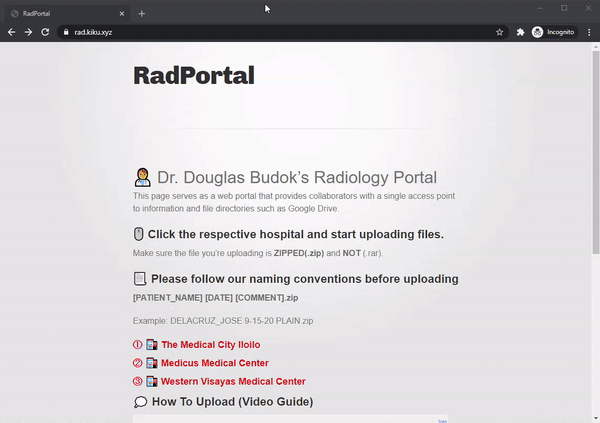

# 👨‍⚕️ Dr. Douglas Budok's Radiology Portal 
This page serves as a web portal that provides collaborators with a single access point to information and file directories such as DropBox.  

## 🖱️ Click the respective hospital and start uploading files. (No sign-in required)
Make sure the file you're uploading is **ZIPPED(.zip)** and **NOT** (.rar).

## ⚠️ Guidelines (Read me before uploading!)
If something is not clear, click the play button "⏯️" beside the number "① " for a video demo and explanation.  
[⏯️](https://files.catbox.moe/rfw4kj.gif) ① Filesize limit is 2GB.  
[⏯️](https://files.catbox.moe/rfw4kj.gif) ② 🗜️ Use .zip to compress files. Do not use .rar compression.  
[⏯️](https://files.catbox.moe/rfw4kj.gif) ③ Verify the files are only zipped ONCE before uploading. Look at the file extension.  
----- Example:  
----- 📁 patient.zip ✔️  
----- 📁 patient.zip.zip ❌  
[⏯️](https://files.catbox.moe/rfw4kj.gif) ④ For accompanying documents, please attach a separate file (.txt, .doc, .docx) and name it according to the patient file.  
----- Example:  
----- 📁 patient.zip ✔️  
----- 📝patient_history.txt ✔️  

### [① 🏥 The Medical City Iloilo ](https://www.dropbox.com/request/SdpHLAAhI0xdNePb7WKo)
### [② 🏥 Medicus Medical Center ](https://www.dropbox.com/request/oAWEwIXFIrlPuhUn62Ao)
### [③ 🏥 Western Visayas Medical Center ](https://www.dropbox.com/request/R32MiVic1zAm21GIxo4I)

## 💭 How To Upload (Video Guide)

