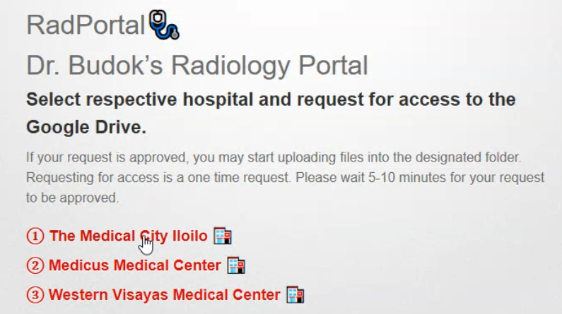
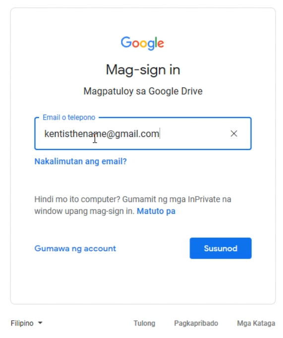
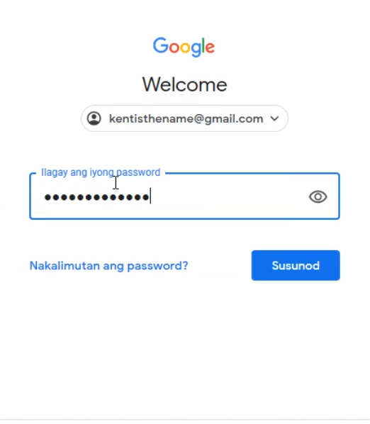
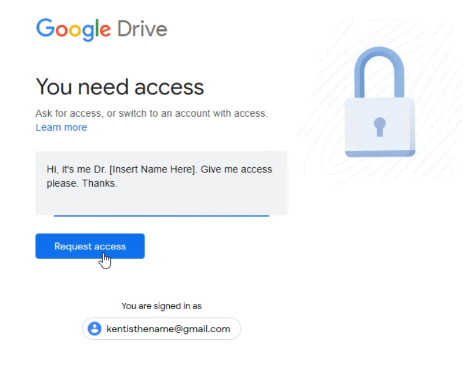
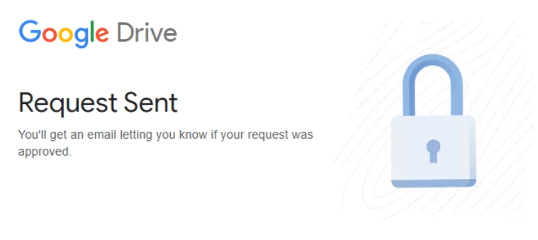

# RadPortal🩺

# Dr. Budok's Radiology Portal

## Select respective hospital and request for access to the Google Drive.
If your request is approved, you may start uploading files into the designated folder.
Requesting for access is a one time request.
Please wait 5-10 minutes for your request to be approved.

### [① The Medical City Iloilo 🏥](https://drive.google.com/drive/folders/1Oli8-FsKlBs2TlBeY-HgykXdQsqHss8c?usp=sharing)
### [② Medicus Medical Center 🏥](https://drive.google.com/drive/folders/1XDL81PD1TQwQH-oEE0wXQh_1isFGkrse?usp=sharing)
### [③ Western Visayas Medical Center 🏥](https://drive.google.com/drive/folders/15L-2_NJbmHVreGEuEdKyQnsCjwTxcVum?usp=sharing)

## 5 Steps To Request Access
#### Step 1

Once you clicked one of the options above, you may be prompted to log in an existing "Gmail Account". This will be used to access the Google Drive.
#### Step 2

Enter your email. If you don't have a Gmail Account, register for one and come back to our [portal](https://rad.kiku.xyz/) and go back to Step 1.
#### Step 3

Enter your password.
#### Step 4

Type a small message in identifying yourself. This will help greatly in making your request be approved faster. You may also leave contact details such as your cellphone number to be notified when your request is approved.
#### Step 5

Wait for the request to be approved and be notified.
